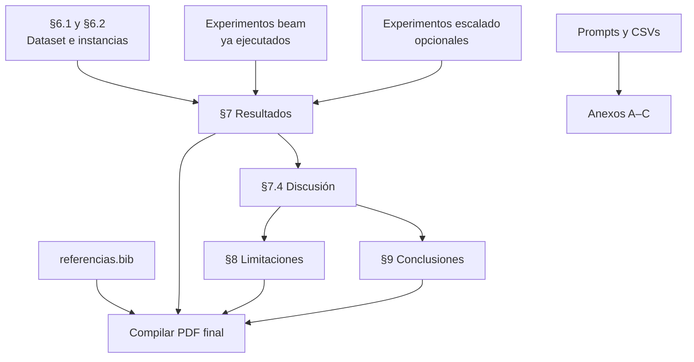

# Plan para terminar el informe

> **Última actualización:** 2026-06-13 — Informe completo: §§6–9, anexos A–C, bibliografía, figuras TikZ y PDF compilado (~37 pp.).

He revisado `informe/informe_tecnico.tex`, los artefactos en `results/` y las notas en `informe/notas_experimentos.md`. Este plan **solo añade contenido en secciones vacías** y corrige detalles menores (figuras, bibliografía); **no reescribe** lo ya redactado (§§1–5 completas, §6.3–6.4 completas).

---

## Estado actual

| Sección | Estado | Líneas aprox. |
|---------|--------|---------------|
| Portada + índice | ✅ Completa | 64–101 |
| §1 Introducción | ✅ Completa | 107–119 |
| §2 Descripción del problema | ✅ Completa | 126–152 |
| §3 Modelado formal | ✅ Completa | 158–262 |
| §4 Diseño de la solución | ✅ Completa (Fig.~\ref{fig:pipeline}) | 269–436 |
| §5 Implementación | ✅ Completa (Fig.~\ref{fig:estructura}) | 443–530 |
| §6.1 Dataset utilizado | ✅ Completa | ~538–555 |
| §6.2 Instancias de prueba | ✅ Completa (2 tablas) | ~556–620 |
| §6.3 Configuración experimental | ✅ Completa | 542–578 |
| §6.4 Métricas | ✅ Completa | 580–673 |
| §7.1 Casos sintéticos | ✅ Completa (tabla + interpretación) | ~766–795 |
| §7.2 Casos benchmark | ✅ Completa (tabla, figura, 4 subapartados) | ~797–860 |
| §7.3 Escalabilidad | ✅ Completa (`dur_5min`, coste API, alcance) | — |
| §7.4 Discusión | ✅ Completa | — |
| §8 Limitaciones y mejoras futuras | ✅ Completa | — |
| §9 Conclusiones | ✅ Completa | — |
| Anexo A — Configuraciones | ✅ Tabla parámetros §6.3 | — |
| Anexo B — Prompts | ✅ Literal desde `prompts.py` | — |
| Anexo C — Resultados CSV | ✅ 12 filas longtable landscape | — |
| Bibliografía | ✅ `informe/referencias.bib` + `\cite{}` | — |
| Gráfico beam | ✅ `results/comparison_bench_beam.png` | — |
| PDF final | ✅ `informe/informe_tecnico.pdf` (~37 pp.) | — |

**Extensión final:** ~37 páginas (PDF compilado con pdflatex + bibtex).

---

## Mapa de dependencias



---

## Fase 0 — Preparación (30 min, sin tocar el .tex)

Antes de escribir, reunir fuentes sin modificar lo existente:

| Fuente | Uso |
|--------|-----|
| `results/experiments_bench_beam.csv` | Tablas §7.1 y §7.2 (10 filas: 5 instancias × `baseline_beam` / `llm_beam`) |
| `results/unified_scaling.csv` | Tabla §7.3 (solo `dur_5min`, 2 filas) |
| `informe/notas_experimentos.md` | Observaciones cualitativas por instancia |
| `planning/f5_bloques_ejecucion.md` | Metadatos de instancias `dur_*` (n, duración, max_duration) |
| `data/instances/*.json` | Conteo de fragmentos por instancia |
| `src/llm/prompts.py` | Anexo B (prompts) |

**Importante:** `informe/informe_tecnico.md` §6 habla de solvers antiguos (`llm_dynamic`, DP, estático). **No copiarlo tal cual** al `.tex`; adaptar terminología a `baseline_beam` / `llm_beam` usando los CSV beam actuales.

**Gráfico:** ✅ Generado `results/comparison_bench_beam.png` e insertado en §7.2.

---

## Fase 1 — Completar §6.1 y §6.2 (~1–1,5 páginas) ✅ HECHO

Objetivo: cerrar la metodología sin repetir §4.2 (que ya describe el pipeline de preparación).

### §6.1 Dataset utilizado ✅

Redactado en `informe/informe_tecnico.tex`: corpus en cuatro familias, referencia a §4.2, alcance experimental (suite sintética + `dur_5min`), Groq/`llama-3.3-70b-versatile`.

### §6.2 Instancias de prueba ✅

Redactado con Tabla~1 (grupos), Tabla~2 (escalado `dur_*`) y subapartados sintéticas/bench, escalado, reales/mini.

---

## Fase 2 — §7 Resultados y análisis (~4–6 páginas) ✅ HECHO

Usar **solo** datos beam actuales. Estructura ya definida en el `.tex`:

### §7.1 Casos sintéticos ✅ HECHO

Redactado con Tabla~`resultados_sinteticos`, interpretación de `example_instance` (reordenación, +30 %) y `example_instance_overlimit` (recorte, +109 %, juez macro 0,75).

### §7.2 Casos benchmark ✅ HECHO

Redactado con Tabla~`resultados_bench`, Figura~`comparison_bench` (`results/comparison_bench_beam.png`), subapartados por instancia y síntesis. Datos desde `experiments_bench_beam.csv`.

### §7.3 Escalabilidad ✅ HECHO

Redactado con Tabla~`escalado_resultados` (`dur_5min`, n=12), coste 147 llamadas / ~6,3 min, alcance incompleto (`dur_10min` interrumpido).

### §7.4 Discusión ✅ HECHO

Síntesis transversal: LLM vs baseline, selección/orden, juez macro, baseline como contraste, límites de escalado.

---

## Fase 3 — §8 Limitaciones y §9 Conclusiones (~2 páginas) ✅ HECHO

### §8 Limitaciones y mejoras futuras ✅

Limitaciones (LLM/cuota, O(n²), alcance experimental, beam search, fragmentación, sin evaluación humana) y mejoras futuras (caché, escalado, videos reales, ablation).

### §9 Conclusiones ✅

Responde: ¿se resolvió?, ¿qué aportó el LLM?, ¿trabajo futuro?

---

## Fase 4 — Anexos y bibliografía (~2–3 páginas) ✅ HECHO

### Anexo A — Configuraciones experimentales ✅

Tabla con parámetros de §6.3 (`beam_width=10`, λ=0.25, `summary_refine_top_m=3`, Groq, flags `--llm --evaluate`).

### Anexo B — Prompts utilizados ✅

Copiado literalmente desde `src/llm/prompts.py` (3 plantillas).

### Anexo C — Resultados completos ✅

Longtable landscape con 12 filas (10 bench + 2 escalado), todas las columnas del CSV.

### Bibliografía ✅

`informe/referencias.bib`: orientación curso, Groq, Llama 3.3, Nenkova & McKeown, Russell & Norvig. Citas en §§1, 2, 4, 5.

---

## Fase 5 — Pulido final (sin reescribir cuerpo) ✅ HECHO

| Tarea | Acción | Estado |
|-------|--------|--------|
| Figuras §4.1 y §5.2 | Diagramas TikZ (`fig:pipeline`, `fig:estructura`) | ✅ |
| Regenerar gráfico | `comparison_bench_beam.png` | ✅ |
| Compilar | pdflatex ×2 + bibtex | ✅ |
| Revisión cruzada | §6.3, §7 y Anexo A coherentes | ✅ |

---

## Orden de trabajo recomendado

```text
Día 1 (2–3 h)
├── §6.1 + §6.2                    ✅
├── §7.1 + §7.2 (tablas + narrativa) ✅
└── Regenerar gráfico beam          ✅

Día 2 (2 h)
├── §7.3 + §7.4                    ✅
├── §8 + §9                        ✅
└── referencias.bib + Anexos A–B   ✅

Día 3 (1 h)
├── Anexo C                        ✅
├── Figuras (placeholders §4–5)    ✅
└── Compilar PDF final             ✅
```

---

## Riesgos y cómo mitigarlos

| Riesgo | Mitigación |
|--------|------------|
| Mezclar terminología DP/beam | Usar solo `experiments_bench_beam.csv`, no `summary_bench.md` (suite antigua) |
| §6.1 duplica §4.2 | En §6.1: «como se describe en la Sección 4.2…» + enfoque experimental |
| Escalado incompleto | Declarado en §7.3 y §8; no inventar filas para `dur_10min`+ |
| Bibliografía rota | ✅ `referencias.bib` creado y compilado |

---

## Checklist de entrega (informe)

- [x] §6.1 Dataset utilizado redactada
- [x] §6.2 Instancias de prueba + tabla
- [x] §7.1 Casos sintéticos con tablas
- [x] §7.2 Casos benchmark con interpretación
- [x] Gráfico `comparison_bench_beam.png` generado e insertado
- [x] §7.3 Escalabilidad (al menos `dur_5min`)
- [x] §7.4 Discusión
- [x] §8 Limitaciones
- [x] §9 Conclusiones
- [x] Anexos A, B, C
- [x] `referencias.bib`
- [x] Placeholders «Figura X» resueltos (§4.1, §5.2)
- [x] PDF compilado sin errores (pdflatex + bibtex)

---

## Checklist de entrega (proyecto completo vs orientación PDF)

| Requisito (orientación 2025–2026) | Estado |
|-----------------------------------|--------|
| **Código:** implementación completa | ✅ `src/` (beam + LLM + experimentos) |
| **Código:** instrucciones de ejecución | ✅ `README.md` |
| **Código:** configuración LLM | ✅ `README.md` + `.env.example` + §5.3 |
| **Informe:** descripción del problema | ✅ §2 |
| **Informe:** modelado formal | ✅ §3 |
| **Informe:** dataset (generación/uso) | ✅ §4.2, §6.1 |
| **Informe:** diseño del algoritmo | ✅ §4 (beam search + juez macro) |
| **Informe:** rol del LLM | ✅ §4.3, §4.5 |
| **Informe:** metodología experimental | ✅ §6 |
| **Informe:** resultados y análisis | ✅ §7 |
| **Informe:** limitaciones y mejoras | ✅ §8 |
| **Diseño exp.:** instancias de prueba | ✅ `data/instances/` |
| **Diseño exp.:** comparación variantes | ✅ `baseline_beam` vs `llm_beam` |
| **Diseño exp.:** análisis comportamiento | ✅ §7 + §7.4 |
| **Tema 2:** LLM evalúa coherencia y relevancia | ✅ |
| **Tema 2:** selección y orden bajo límite temporal | ✅ |

### Pendiente opcional (no bloquea la entrega mínima)

- [ ] Reanudar escalado `dur_10min`–`dur_20min` (experimento API, ~1–6 h)
- [ ] Evaluar `mini_video_*` o `video_*` con LLM (refuerzo experimental, no exigido explícitamente)
- [ ] Actualizar `README.md`: enlace al PDF final (`informe/informe_tecnico.pdf`) en lugar de solo `informe_tecnico.md`
- [ ] Empaquetar entrega (ZIP repo + PDF) según indicaciones del campus
- [ ] Commit/push final del repositorio

---

**Estado global:** el proyecto cumple los requisitos de la orientación para entrega. Lo pendiente es opcional (más experimentos) o administrativo (empaquetado/campus).
